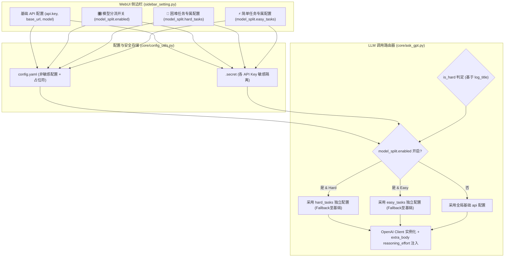

# 高低难度任务独立多模型与推理配置实现计划 (Implementation Plan)

> **For agentic workers:** REQUIRED SUB-SKILL: Use superpowers:subagent-driven-development to implement this plan task-by-task. Steps use checkbox (`- [ ]`) syntax for tracking.

**Goal:** 实现困难任务与简单任务的 LLM 模型、厂商 API 接口、密钥与推理强度的完全解耦与独立配置，支持 WebUI 折叠/展开控制与纯 OpenAI 规范 Reasoning 传递。

**Architecture:**
在 `config.yaml` 引入 `model_split` 配置结构，并在 `core/ask_gpt.py` 内部建立任务难度智能路由器 `resolve_api_config`，结合 `model_split.enabled` 与任务 `log_title` 动态派发对应的 API 凭据、模型名称和 `reasoning_effort`；在 WebUI 侧边栏通过动态 Toggle 开关实现基础模式与高级分流模式的平滑切换。

**Architecture Diagram:**



**Tech Stack:** Python 3.10+, OpenAI Python SDK, Streamlit, Ruamel.yaml, Pytest.

## Global Constraints
- **Python**: 兼容 3.10+
- **配置持久化**: 密钥必须存储于 `.secret`，配置文件 `config.yaml` 中仅存储 `'not here'`
- **Reasoning 协议**: 采用 OpenAI 标准 `extra_body: {"reasoning_effort": effort}`
- **向下兼容**: `model_split.enabled` 为 `false` 时行为与原系统 100% 一致

---

### Task 1: 扩展全局配置模板与安全敏感 Key 校验

**Files:**
- Modify: [config.yaml](file:///Users/chen/code/AuraSub/config.yaml)
- Modify: [i18n/中文/config.yaml](file:///Users/chen/code/AuraSub/i18n/中文/config.yaml)
- Modify: [core/config_utils.py](file:///Users/chen/code/AuraSub/core/config_utils.py)
- Test: `tests/test_model_split.py`

**Interfaces:**
- Produces: `model_split` 在 `config.yaml` 中的默认节点与 `.secret` 敏感键自动隔离。

- [ ] **Step 1: 编写测试用例验证配置加载与敏感 Key 隔离**

```python
# tests/test_model_split.py
import os
import pytest
from core.config_utils import load_key, update_key, is_sensitive_key

def test_sensitive_keys_detection():
    assert is_sensitive_key("api.key") is True
    assert is_sensitive_key("model_split.hard_tasks.key") is True
    assert is_sensitive_key("model_split.easy_tasks.key") is True
    assert is_sensitive_key("model_split.enabled") is False
    assert is_sensitive_key("model_split.hard_tasks.model") is False

def test_config_model_split_structure():
    enabled = load_key("model_split.enabled")
    assert isinstance(enabled, bool)
    hard_tasks = load_key("model_split.hard_tasks")
    assert "model" in hard_tasks
    assert "reasoning_effort" in hard_tasks
    easy_tasks = load_key("model_split.easy_tasks")
    assert "model" in easy_tasks
    assert "reasoning_effort" in easy_tasks
```

- [ ] **Step 2: 运行测试并确认失败**

Run: `pytest tests/test_model_split.py -v`
Expected: FAIL with `KeyError: "Key 'model_split' not found in configuration"`

- [ ] **Step 3: 在 `config.yaml` 和 `i18n/中文/config.yaml` 中添加 `model_split` 默认结构**

```yaml
# 高低难度任务独立多模型与推理配置
model_split:
  enabled: false
  hard_tasks:
    key: 'not here'
    base_url: ''
    model: ''
    reasoning_effort: 'high'
  easy_tasks:
    key: 'not here'
    base_url: ''
    model: ''
    reasoning_effort: 'low'
```

- [ ] **Step 4: 运行测试并确认通过**

Run: `pytest tests/test_model_split.py -v`
Expected: PASS

- [ ] **Step 5: 提交代码**

```bash
git add config.yaml "i18n/中文/config.yaml" tests/test_model_split.py
git commit -m "feat(config): add model_split configuration schema for hard/easy tasks"
```

---

### Task 2: 重构 `ask_gpt.py` 动态路由器与连通性检测

**Files:**
- Modify: [core/ask_gpt.py](file:///Users/chen/code/AuraSub/core/ask_gpt.py)
- Test: `tests/test_model_split.py`

**Interfaces:**
- Produces: `resolve_api_config(is_hard: bool) -> tuple[str, str, str, str]`
- Produces: `check_api(target="base" | "hard" | "easy") -> bool`
- Modifies: `ask_gpt(prompt, ...)`

- [ ] **Step 1: 编写 `resolve_api_config` 与分流调用单元测试**

```python
# tests/test_model_split.py (追加测试)
from core.ask_gpt import resolve_api_config, check_is_hard_task

def test_task_difficulty_classification():
    assert check_is_hard_task("logical_chunking") is True
    assert check_is_hard_task("asr_correction_1") is True
    assert check_is_hard_task("translate_expressiveness") is True
    assert check_is_hard_task("punctuation") is True
    assert check_is_hard_task("translate_faithfulness") is False
    assert check_is_hard_task("summary") is False
    assert check_is_hard_task("subtitle_trim") is False

def test_resolve_api_config_fallback():
    # 模拟分流关闭状态
    update_key("model_split.enabled", False)
    api_key, base_url, model, effort = resolve_api_config(is_hard=True)
    assert api_key == load_key("api.key")
    assert base_url == load_key("api.base_url")
    assert model == load_key("api.model")
    assert effort == load_key("reasoning.hard_tasks")
```

- [ ] **Step 2: 运行测试并确认失败**

Run: `pytest tests/test_model_split.py::test_task_difficulty_classification -v`
Expected: FAIL with `ImportError: cannot import name 'resolve_api_config'`

- [ ] **Step 3: 在 `core/ask_gpt.py` 中实现 `check_is_hard_task`、`resolve_api_config` 与 `check_api`**

```python
# core/ask_gpt.py

def check_is_hard_task(log_title: str) -> bool:
    if not log_title:
        return False
    hard_titles = ['logical_chunking', 'translate_expressiveness', 'sentence_splitbymeaning', 'punctuation']
    return any(t in log_title for t in hard_titles) or log_title.startswith('asr_correction')

def resolve_api_config(is_hard: bool):
    """Resolve API key, base_url, model, and reasoning_effort based on task difficulty and split config."""
    base_api = load_key("api")
    is_split_enabled = False
    try:
        is_split_enabled = bool(load_key("model_split.enabled"))
    except Exception:
        is_split_enabled = False

    if is_split_enabled:
        split_key = "model_split.hard_tasks" if is_hard else "model_split.easy_tasks"
        try:
            task_cfg = load_key(split_key) or {}
            api_key = task_cfg.get("key") if task_cfg.get("key") and task_cfg.get("key") != 'not here' else base_api.get("key")
            base_url = task_cfg.get("base_url") or base_api.get("base_url")
            model = task_cfg.get("model") or base_api.get("model")
            effort = task_cfg.get("reasoning_effort") or ("high" if is_hard else "low")
            return api_key, base_url, model, effort
        except Exception:
            pass

    # Fallback to base configuration
    effort_key = "reasoning.hard_tasks" if is_hard else "reasoning.easy_tasks"
    effort = load_key(effort_key)
    return base_api.get("key"), base_api.get("base_url"), base_api.get("model"), effort

def check_api(target="base") -> bool:
    """Test API connection for base, hard, or easy task model configuration."""
    try:
        base_api = load_key("api")
        if target == "hard":
            cfg = load_key("model_split.hard_tasks") or {}
        elif target == "easy":
            cfg = load_key("model_split.easy_tasks") or {}
        else:
            cfg = base_api
            
        api_key = cfg.get("key") if cfg.get("key") and cfg.get("key") != 'not here' else base_api.get("key")
        base_url = cfg.get("base_url") or base_api.get("base_url")
        model = cfg.get("model") or base_api.get("model")
        
        if not api_key or api_key == 'not here':
            return False
            
        url = base_url.strip('/') + '/v1' if 'v1' not in base_url else base_url
        client = OpenAI(api_key=api_key, base_url=url, timeout=10.0)
        
        resp = client.chat.completions.create(
            model=model,
            messages=[{"role": "user", "content": "Respond with {'message':'success'} in json"}],
            response_format={"type": "json_object"} if model in load_key("llm_support_json") else None
        )
        return True
    except Exception as e:
        print(f"API Check failed for [{target}]: {e}")
        return False
```

- [ ] **Step 4: 更新 `ask_gpt` 函数内部使用 `resolve_api_config`**

```python
# ask_gpt() 内部替换逻辑:
is_hard = check_is_hard_task(log_title)
api_key, base_url, model, configured_effort = resolve_api_config(is_hard)

if not api_key or api_key == 'not here':
    raise ValueError("⚠️ API_KEY is missing")

url = base_url.strip('/') + '/v1' if 'v1' not in base_url else base_url
client = OpenAI(api_key=api_key, base_url=url)
response_format = {"type": "json_object"} if response_json and model in llm_support_json else None

# completion_args:
completion_args = {
    "model": model,
    "messages": messages
}
if response_format is not None:
    completion_args["response_format"] = response_format

if configured_effort and str(configured_effort).lower() != "none":
    completion_args["extra_body"] = {"reasoning_effort": str(configured_effort).lower()}

if attempt == 0:
    task_type = "🧠 Hard Task" if is_hard else "⚡ Easy Task"
    print(f"[{task_type}] Target: {url} | Model: {model} | Reasoning: {configured_effort}")
```

- [ ] **Step 5: 运行全量测试验证**

Run: `pytest tests/test_model_split.py -v`
Expected: PASS

- [ ] **Step 6: 提交代码**

```bash
git add core/ask_gpt.py tests/test_model_split.py
git commit -m "feat(llm): implement dynamic multi-model task dispatcher and independent check_api"
```

---

### Task 3: 改造 WebUI 侧边栏交互组件 (中英文支持)

**Files:**
- Modify: [st_components/sidebar_setting.py](file:///Users/chen/code/AuraSub/st_components/sidebar_setting.py)
- Modify: [i18n/中文/st_components/sidebar_setting.py](file:///Users/chen/code/AuraSub/i18n/中文/st_components/sidebar_setting.py)

**Interfaces:**
- Produces: 交互式侧边栏，支持基础模式与动态展开的困难/简单任务独立配置面板。

- [ ] **Step 1: 在 `st_components/sidebar_setting.py` 中更新 `page_setting`**
  - 基础设置区保留主 `API_KEY`、`BASE_URL`、`MODEL` 与 `📡` 测试。
  - 新增 `st.toggle("🎛️ Enable Multi-Model Task Splitting (Advanced)", value=load_key("model_split.enabled"))`。
  - 当未开启时：显示简洁的双列 Reasoning Effort 下拉选择。
  - 当开启时：分别展示 `🧠 Hard Tasks Model (Chunking, ASR Correction, Expressiveness, Punctuation)` 与 `⚡ Easy Tasks Model (Faithfulness, Summary, Dub Trim)` 的 `API_KEY`、`BASE_URL`、`MODEL`、`Reasoning Effort` 与独立的 `📡` 连通性测试按钮。

- [ ] **Step 2: 同步更新 `i18n/中文/st_components/sidebar_setting.py`**
  - 提供标准的中文本地化文案与提示。

- [ ] **Step 3: 验证 Streamlit 语法与导入无循环依赖**

Run: `python -c "import st_components.sidebar_setting; print('sidebar_setting OK')"`
Expected: `sidebar_setting OK`

Run: `python -c "import i18n.中文.st_components.sidebar_setting; print('i18n sidebar_setting OK')"`
Expected: `i18n sidebar_setting OK`

- [ ] **Step 4: 提交代码**

```bash
git add st_components/sidebar_setting.py "i18n/中文/st_components/sidebar_setting.py"
git commit -m "feat(ui): add advanced multi-model task splitting controls in sidebar"
```

---

### Task 4: 端到端功能测试与全链路回归验证

**Files:**
- Test: `tests/test_model_split.py`
- Manual Check: `ask_gpt` 端到端调用与 Streamlit 渲染

- [ ] **Step 1: 编写全面的多模型路由回退与参数传递测试**
  - 测试分流开启且各自配置不同模型时的路由。
  - 测试分流开启但留空时的默认回退。
  - 测试 reasoning_effort 为 none 时不传入 extra_body。

- [ ] **Step 2: 运行全量测试套件**

Run: `pytest tests/ -v`
Expected: ALL PASS

- [ ] **Step 3: 最终提交**

```bash
git add tests/
git commit -m "test(model_split): add comprehensive end-to-end multi-model routing tests"
```
